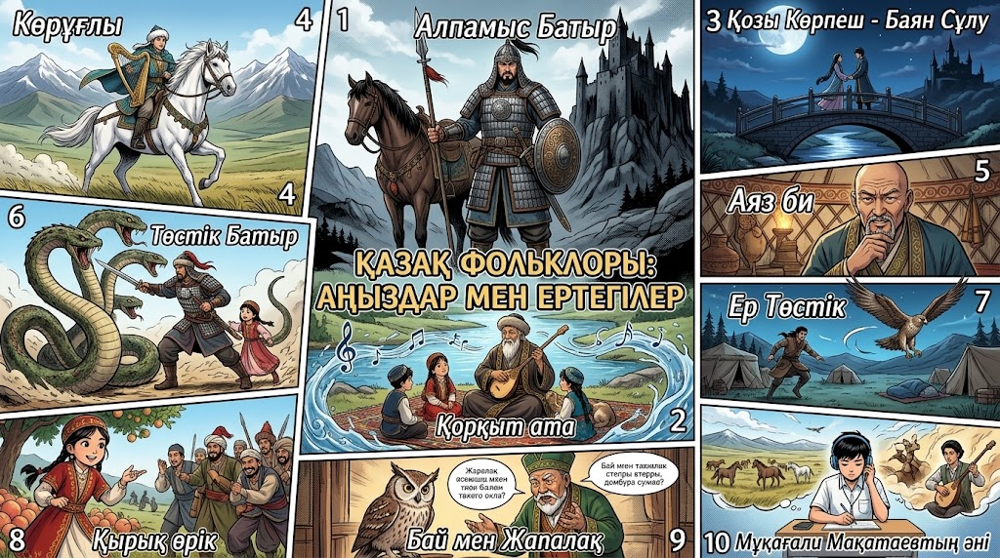

<div align="center">

# ✦ QYRAN STUDIO

### Қазақ фольклорын интерактивті комикске айналдыратын AI Storytelling Studio

<p>
  
  
  
</p>

**Аңыз. Кейіпкер. Кадр. Дауыс. Бір студия.**

_Qyran Studio — қазақ және түркі аңыздарын, батырлық жырларын және ертегілерін интерактивті web-комикс, manga, animation және mobile-story форматына дайындайтын креативті AI-платформа._

[Мүмкіндіктер](#мүмкіндіктер) · [Экрандар](#студия-экрандары) · [Іске қосу](#жылдам-іске-қосу) · [Технологиялар](#технологиялар)

</div>

---



## ✨ Неге Qyran Studio?

Фольклор — мұрағатта жататын мәтін емес. Ол жаңа ұрпақтың экранында өмір сүруі керек.

**Qyran Studio** авторға аңыздың мәтінінен бастап, интерактивті комикстің толық production-процесіне дейін бір жұмыс кеңістігін береді. Платформа білім беру, мәдени мұраны цифрландыру және entertainment-жобаларға арналған.

> «Ер Төстік», «Алпамыс батыр», «Қозы Көрпеш — Баян сұлу», «Қорқыт ата» және ондаған басқа хикаялар — жаңа визуалды тілде.

## 🎯 Мүмкіндіктер

| Модуль | Не жасайды |
| --- | --- |
| **Stories Dashboard** | Жобаларды, оқылым статистикасын, сахналарды және карточкаларды басқарады. |
| **AI Story Wizard** | Сценарийді қабылдап, оны сахналар мен кадрларға бөлуге дайындайды. |
| **Folklore Library** | Қазақ фольклорындағы дайын сюжеттерді бір басумен сценарийге қосады. |
| **Comic Studio Editor** | Кадрлар, диалог, композиция, параллакс және motion-триггерлермен жұмыс істейді. |
| **AI Story Director** | Режиссёрлік ұсыныс, камера ракурсы және панель қасиеттерін көрсетеді. |
| **Mobile Focus Mode** | Телефон экраны үшін webtoon/editor тәжірибесін ұсынады. |
| **Media Vault** | Кейіпкерлер, сахналар, дайын кадрлар және визуалды ассеттердің қоры. |

## 🧭 Студия экрандары

```text
Stories Dashboard
       │
       ├── Жаңа жоба / AI Story Wizard
       │       ├── Хикая таңдау
       │       ├── Сценарий енгізу
       │       └── Визуалды стиль таңдау
       │
       ├── Comic Studio Editor
       │       ├── Scenes rail
       │       ├── Interactive comic canvas
       │       ├── AI Story Director
       │       └── Timeline
       │
       ├── Mobile Preview
       └── Media Vault
```

## 🖼️ Визуалды бағыт

Дизайн тілі — **Neo-Brutalist Comic Futurism**:

- көмірдей қара studio-сurface;
- electric yellow — әрекет пен фокус;
- cyber cyan — AI және техникалық статус;
- halftone grid, қатты көлеңке, қалың комикс шекаралары;
- `Bebas Neue` + `Space Grotesk` + `Space Mono` типографикасы.

## ⚡ Жылдам іске қосу

### Талаптар

- Node.js 18 немесе жаңа нұсқа
- npm 9 немесе жаңа нұсқа

### Орнату

```bash
git clone https://github.com/bagdau/Qyran-Studio.git
cd Qyran-Studio
npm install
npm run dev
```

Браузерде Vite берген жергілікті URL-ды ашыңыз.

### Production build

```bash
npm run build
npm run test:sites
```

## 🧰 Технологиялар

- **React 19** — интерактивті интерфейс және UI state
- **Vite 6** — жылдам development/build workflow
- **Material Symbols** — studio иконографиясы
- **CSS** — responsive layout, halftone texture және comic-studio визуалды жүйесі

## 🗂️ Жоба құрылымы

```text
src/
 ├── App.jsx          # Экрандар, навигация және интеракциялар
 ├── styles.css       # Qyran Studio дизайн жүйесі
 └── main.jsx         # React entry point
public/assets/
 ├── folklore-catalog.png
 └── folklore-styles.png
```

## 🚀 Hackathon бағыты

Qyran Studio мәдени мұраны жаңа digital-format-қа бейімдейді:

- мектептер мен университеттерге — қызықты білім беру материалы;
- музейлер мен мәдени орталықтарға — интерактивті экспозиция;
- авторлар мен иллюстраторларға — жылдам прототиптеу құралы;
- жас аудиторияға — аңыздарды өз тілімен танытатын experience.

## 🛣️ Roadmap

- [ ] LLM арқылы толық сценарий талдауы
- [ ] Text-to-image / image-to-image кадр генерациясы
- [ ] Қазақ тіліндегі дауыс, SFX және narration
- [ ] Жобаларды сақтау және авторизация
- [ ] Webtoon/PDF/interactive player export
- [ ] Бірлескен редакциялау режимі

---

<div align="center">

### QYRAN STUDIO

**Тамырдан туған хикая. Болашаққа арналған комикс.**

Made with ⚡ for Kazakhstan's creative industry

</div>
